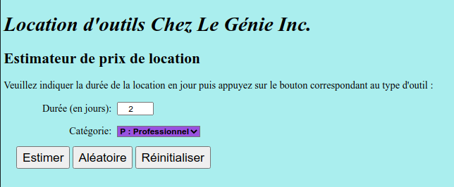
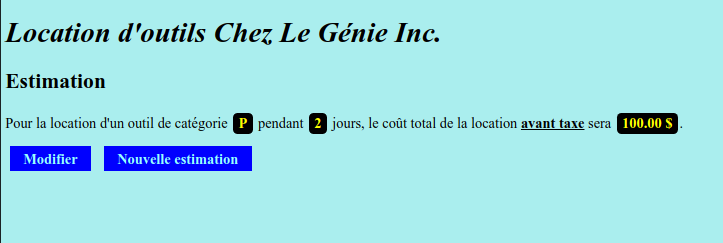

# Estimateur de prix de location d'outils | Tool rental price estimator
 
Simple estimateur de prix de location d'outils pour petite structure ou entrepreneur.

Fonctionnalités de base tels que choix de catégorie ou durée en jours avec la possibilité d'estimer le prix aléatoirement et de le réinitialiser à une durée de 1 jour.

Logiciels et langages utilisés :
* 
* 

* 

* 
* 

Système d'exploitation :
* 

## Démarrer XAMPP sous Linux
```bash
sudo /opt/lampp/lampp start
```
## Aperçu




[](https://opensource.org/licenses/MIT)
